# Software Architecture

This document defines the software architecture of the OreSat reaction wheel firmware. It describes the runtime model, subsystem ownership, control and data flow, public boundaries, implementation status, and architectural rules that govern future development.

Repository layout, build commands, and contributor workflow belong in the repository `README.md` and build-system documentation rather than in this document.

---

# 1. Scope

This document covers:

- Production motor-control architecture
- Deterministic 16 kHz execution
- Supervisory state management
- Measurement acquisition and preprocessing
- Controller and commutation boundaries
- Calibration and persistent storage
- UART experiment telemetry
- CAN/Object Dictionary scaffolding and its current implementation status
- Hardware abstraction and platform-specific services
- Dependency and extension rules

Detailed peripheral configuration, algorithm derivations, packet field definitions, calibration procedures, and experiment instructions should remain in subsystem-specific documentation.

---

# 2. Architectural Goals

| Goal | Architectural Meaning |
|------|------------------------|
| Deterministic Execution | The production motor-control path executes at 16 kHz with bounded work and no blocking transport operations. |
| Safe Actuation | Invalid measurements, hardware faults, and invalid controller state produce a disabled or floated inverter command. |
| Explicit Ownership | Each module owns a narrow set of state, policy, and transformations. |
| Strategy Independence | Motor-control objectives are separated from the selected commutation implementation. |
| Hardware Isolation | Controller and commutation code consume hardware-independent measurements and commands. |
| Reusability | Production, bring-up, calibration, and experiment applications reuse the same subsystem interfaces. |
| Extensibility | Hardware revisions and new algorithms can be introduced without restructuring the complete firmware. |
| Observable Operation | Diagnostics and telemetry expose state without moving transport work into the control path. |

---

# 3. System Context

The firmware controls a three-phase brushless reaction wheel using rotor position, phase-current, bus-voltage, phase-voltage, and thermal measurements. It generates complementary PWM commands for an external inverter and exposes test telemetry over UART.

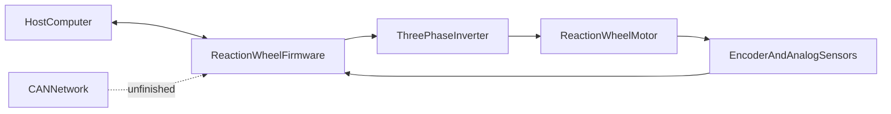

UART telemetry is operational and is the current experiment interface. The CAN path is not operational; only portions of the internal translation and Object Dictionary scaffolding exist.

---

# 4. Architectural Overview

The implementation is best understood as cooperating subsystems rather than a strict stack in which every module depends only on the immediately adjacent layer.

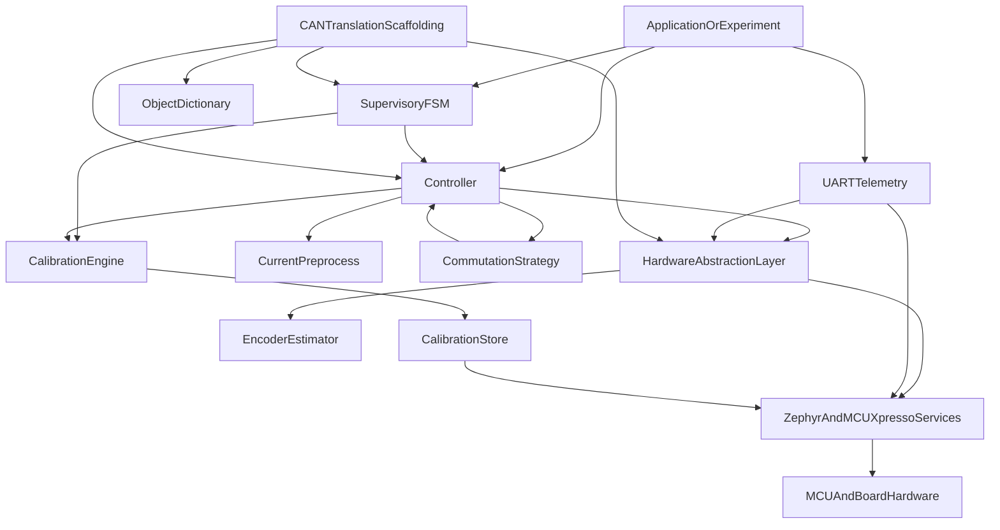

The final `Commutation --> Controller` arrow represents return of a unified PWM command to the controller, not a source-code dependency from a strategy back into controller internals.

## 4.1 Primary Ownership

| Subsystem | Primary Ownership |
|-----------|-------------------|
| Application | Startup, thread creation, and application- or experiment-specific sequencing |
| Supervisory FSM | Coarse lifecycle policy: boot, calibration, idle, armed, closed-loop, and fault |
| Controller | Deterministic motor-control orchestration, objective modes, outer-loop state, safety response, strategy dispatch, and final PWM write |
| Calibration | Deterministic calibration state machine and validated runtime calibration snapshot |
| Calibration Store | Versioned, CRC-protected NVS persistence |
| Current Preprocess | Current reconstruction, common-mode removal, and current-quality diagnostics |
| Encoder | Rotor estimator state and conversion from raw counts to mechanical/electrical state |
| Commutation | Per-strategy conversion from physical command inputs to a unified inverter command |
| HAL | Coherent measurement cache, board initialization, and hardware-independent sensor/actuator API |
| Telemetry | Versioned UART packet generation, experiment metadata, bounded packet queue, and asynchronous transport |
| Object Dictionary | Shared command, configuration, and telemetry storage only |
| CAN Translation | Translation between Object Dictionary values and internal FSM/controller interfaces; incomplete |
| Math Utilities | Generic math and BLDC-specific coordinate transforms used by higher-level modules |

---

# 5. Runtime Execution Model

Firmware execution is divided into a deterministic fast path and application-dependent slow or asynchronous work.

## 5.1 Deterministic Fast Path

The production fast-path entry point is:

```c
Controller_Update16kHz();
```

One invocation performs a complete control cycle. The application is responsible for invoking it at the required 16 kHz cadence.

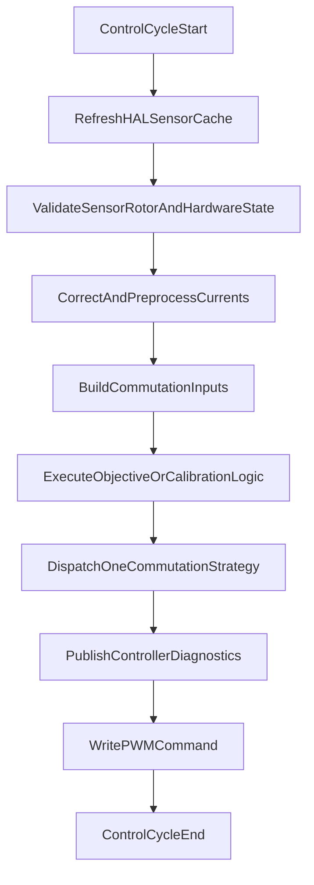

The fast path may include bounded measurement acquisition, estimator updates, control calculations, calibration state updates, strategy calculations, diagnostics snapshots, and non-blocking telemetry packet production.

It must not perform:

- Blocking UART or CAN transmission
- Sleeps or yields
- Unbounded waits
- Dynamic allocation
- Filesystem operations
- High-volume console printing
- Application-level experiment analysis

## 5.2 Supervisory Execution

`FsmUpdate()` operates at a coarse supervisory rate chosen by the application. It does not execute the 16 kHz control algorithm.

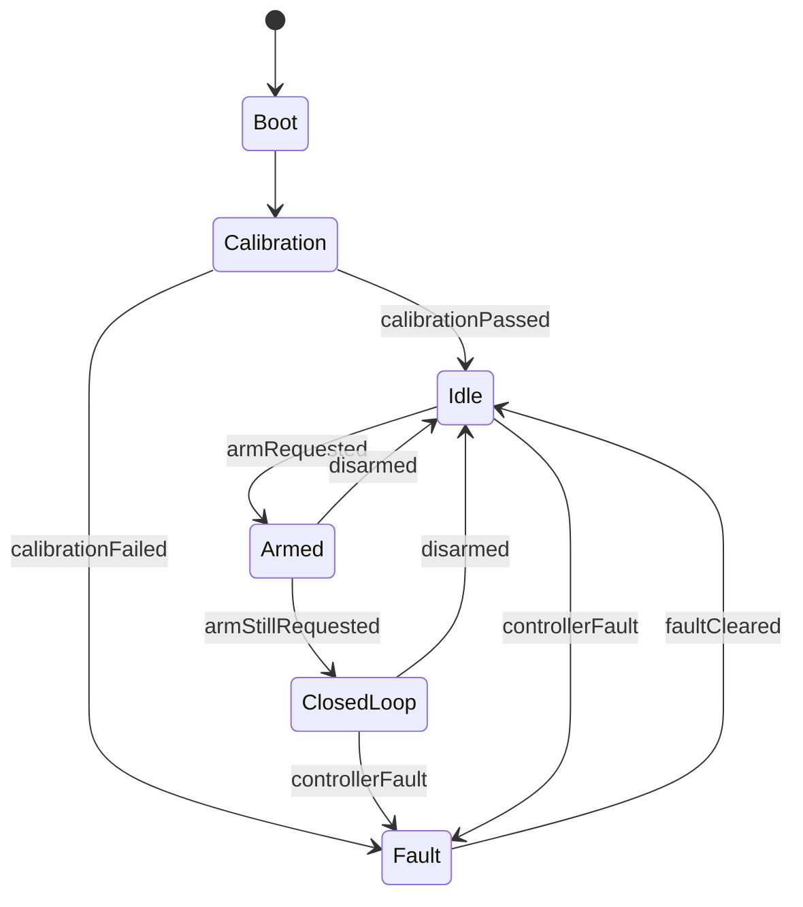

The supervisor commands controller modes; it does not implement control laws or commutation mathematics.

## 5.3 Asynchronous UART Execution

UART telemetry does not require a dedicated firmware telemetry thread in the current implementation. The 16 kHz producer builds and queues decimated packets, while the Zephyr asynchronous UART callback drains the queue.

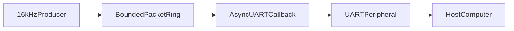

The application may still use separate threads for experiments or supervision, but those threads are application composition rather than an invariant of the telemetry subsystem.

---

# 6. Control and Measurement Data Flow

## 6.1 Closed-Loop Data Flow

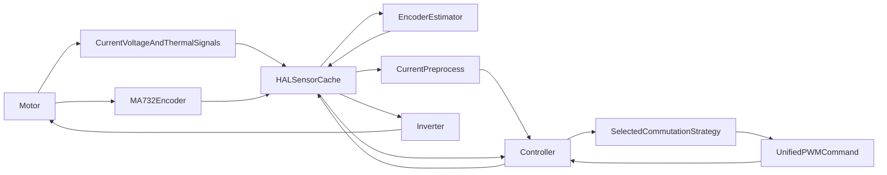

Measurements propagate upward as physical-unit snapshots. Commands propagate downward as a `HalPwmCommand_t` containing normalized duties, phase-float controls, and gate-driver enable state.

## 6.2 Sensor Cache Update Order

The HAL coordinates the following update sequence:

1. Acquire the PWM-synchronous ADC bundle.
2. Convert raw ADC values to engineering units.
3. Acquire the encoder sample and update rotor state.
4. Acquire or refresh thermal state.
5. Publish coherent cached measurements through HAL accessors.

ADC0 owns the PWM-triggered fast bundle. ADC1 thermal acquisition is software-triggered and intentionally excluded from the 16 kHz hardware trigger route.

## 6.3 PWM and ADC Synchronization

FlexPWM generates the inverter carrier and the ADC trigger point. The INPUTMUX routes the selected PWM trigger to ADC0. This preserves deterministic alignment between switching and fast analog acquisition.


---

# 7. Application and Supervisory Architecture

## 7.1 Application Responsibilities

Applications compose the shared modules and decide:

- Initialization order
- Which periodic contexts invoke `Controller_Update16kHz()` and `FsmUpdate()`
- Experiment trigger handling
- Experiment state and timing
- Telemetry enable/disable policy
- Which commutation strategy and controller objective are requested
- Application-specific completion and fault reporting

Applications must not duplicate reusable controller, commutation, calibration, encoder, or HAL behavior.

## 7.2 Supervisory FSM

The FSM owns system lifecycle policy:

- Start calibration after boot
- Enter idle after successful calibration
- Arm and disarm the wheel
- Enter normal closed-loop operation
- Enter and hold a fault state
- Coordinate explicit fault recovery

It commands the controller at a coarse level and never directly generates PWM.

## 7.3 Experiment Applications

Experiment applications reuse the production controller and telemetry interfaces while defining repeatable operating profiles.

Typical experiment applications include:

| Experiment | Purpose |
|------------|---------|
| Power Ripple | Measure electrical consumption and steady-state ripple across speed plateaus |
| Torque-Speed | Measure wheel torque over a controlled speed ramp |
| Dynamic Response | Measure transient response to commanded changes |
| Thermal | Measure thermal behavior during extended operation |

Experiment timing and state machines belong to the application. The underlying motor-control modules remain shared.

---

# 8. Controller Architecture

## 8.1 Role

The controller is the owner of the production 16 kHz orchestration path. It converts high-level objectives into one `CommutationInputs_t`, dispatches exactly one strategy, receives one `HalPwmCommand_t`, and applies that command through the HAL.

## 8.2 Objective Modes

The controller supports:

| Mode | Meaning |
|------|---------|
| `CTRL_MODE_IDLE` | Safe inactive output |
| `CTRL_MODE_TORQUE` | Direct torque objective |
| `CTRL_MODE_VELOCITY` | Velocity ramp and PI control producing torque demand |
| `CTRL_MODE_POSITION` | Position objective interface; implementation status should be documented with its subsystem details |
| `CTRL_MODE_CALIBRATION` | Controller-hosted execution of the calibration engine |
| `CTRL_MODE_STARTUP_OPEN_LOOP` | Forced-angle startup using open-loop vector commutation |
| `CTRL_MODE_VOLTAGE` | Direct d/q voltage objective |

## 8.3 Responsibilities

The controller owns:

- Controller and requested commutation modes
- Public setpoints
- Velocity ramping and velocity PI state
- Torque/current/voltage command conversion
- Startup angle and startup voltage state
- Current-offset application and invocation of current preprocessing
- Safety checks and controller fault latch
- Strategy binding and dispatch
- Final PWM write
- Controller diagnostic snapshot

The controller does not own:

- ADC, SPI, GPIO, PWM-register, or UART drivers
- Encoder estimator implementation
- Calibration algorithm internals
- Per-strategy commutation mathematics
- Experiment sequencing
- CAN or UART transport policy

## 8.4 Safety Behavior

The controller applies a safe inverter command and latches a fault when required sensor acquisition fails, a hardware fault is present, or rotor validity is required but unavailable.

A safe command uses centered duty values, floats all phases, and disables the gate driver.

## 8.5 Strategy Selection

The requested commutation mode normally selects the active strategy. Two controller modes override that request:

- Calibration selects the strategy required by the active calibration state.
- Startup open-loop forces the open-loop vector strategy.

This distinction prevents application policy from bypassing calibration or startup requirements.

---

# 9. Current Measurement Preprocessing

`CurrentPreprocess` sits between HAL current conversion and controller/commutation use.

It owns:

- Optional best-two-of-three current reconstruction
- Optional common-mode removal
- Automatic or forced dropped-phase selection
- Reconstruction counters and sample-validity diagnostics


Automatic dropped-phase selection may use the previous PWM command to identify a phase whose duty is closest to a switching rail. ADC acquisition and counts-to-amperes conversion remain HAL responsibilities.

---

# 10. Encoder Architecture

## 10.1 Boundary

The HAL owns MA732 SPI acquisition and supplies raw encoder counts plus measured sample interval. `Encoder` owns estimator state and derived rotor quantities.

## 10.2 Owned State

The encoder module owns:

- Wrapped mechanical position
- Mechanical velocity estimate
- Electrical angle and velocity derivation
- Direction convention
- Electrical offset
- Invalid-interval recovery
- Encoder-glitch recovery and diagnostics

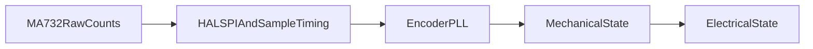

Mechanical state remains in the encoder's raw mechanical convention. Direction and electrical offset are applied when deriving electrical state.

---

# 11. Commutation Architecture

## 11.1 Common Strategy Boundary

Every strategy implements the same lifecycle interface:

- `Init()`
- `Update(const CommutationInputs_t *)`
- `Stop()`

The controller constructs one physical input bundle per cycle. Each strategy reads the fields it requires and returns a unified PWM command.

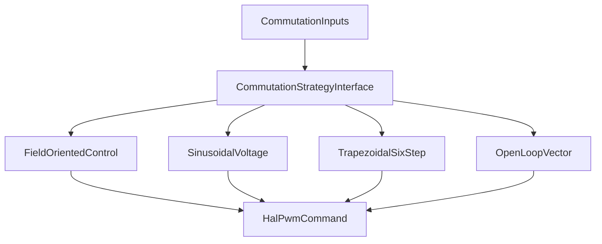

Strategies do not write hardware directly.

## 11.2 Field-Oriented Control

FOC owns:

- Clarke and Park transformation of measured currents
- d/q current PI control
- Configurable resistive, Back-EMF, omega-L, and decoupling terms
- Circular voltage limiting to the linear SVM region
- Anti-windup back-calculation
- Inverse Park transformation
- Space Vector Modulation
- Strategy-local integrators and diagnostic snapshot

FOC consumes calibrated motor parameters when valid and configured fallback values otherwise.

## 11.3 Sinusoidal Commutation

The sinusoidal strategy:

- Uses the controller-supplied electrical angle
- Applies the established q-axis sign and 90-degree phase convention
- Generates three references separated by 120 electrical degrees
- Uses centered direct sinusoidal PWM
- Actively drives all three phases during normal operation
- Owns no persistent runtime state

It does not use inverse Park or SVM.

## 11.4 Trapezoidal Commutation

The trapezoidal strategy:

- Implements unipolar six-step commutation
- Drives two phases and floats one phase
- Preserves the established sector advance and PCB phase-routing offset
- Coasts rather than reversing for negative torque requests
- Owns no persistent runtime state

## 11.5 Open-Loop Vector Commutation

The open-loop strategy:

- Consumes a controller-supplied electrical angle
- Consumes controller-supplied d/q voltage commands
- Limits voltage using DC-bus availability
- Performs inverse Park and SVM
- Owns no forced-angle, capture, or handoff policy

Forced-angle generation and startup sequencing remain controller or application responsibilities.

---

# 12. Math Foundations

The math layer is divided into two modules.

| Module | Ownership |
|--------|-----------|
| `MathUtil` | Generic scalar functions, trigonometric wrappers, finite/NaN checks, approximations, and angle wrapping |
| `BldcMath` | Three-phase data types, Clarke/Park transforms, inverse Park, SVM, and BLDC duty validation |

Motor-specific coordinate transforms belong in `BldcMath`; generic utilities remain independent of motor assumptions.

---

# 13. Calibration Architecture

## 13.1 Runtime Calibration Engine

Calibration is not only persistent data storage. It is a deterministic state machine executed synchronously from the controller path.

The current implementation includes:

- Current-sensor alpha/beta offset calibration
- Static multi-point encoder electrical-offset calibration
- Optional forward/reverse moving phase-sweep diagnostics
- Phase resistance identification
- Phase inductance identification
- Runtime result and data snapshot management
- Validation before persistence

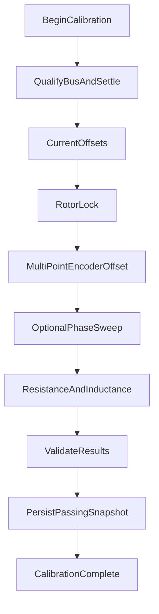

Sensor snapshots are supplied by the controller. Calibration writes requested drive values into the same `CommutationInputs_t` boundary used by normal operation.

## 13.2 Calibration Data

The runtime calibration snapshot includes:

- Calibration result and validity
- Current offsets
- Encoder electrical offset
- Phase resistance
- Phase inductance
- Bus-voltage snapshot
- Available thermal snapshot

Validated calibration values are read by controller and commutation modules during operation.

## 13.3 Persistent Storage

`CalibrationStore` owns persistence only:

- Zephyr NVS initialization
- Record serialization
- Magic and version validation
- CRC integrity validation
- Load, save, and erase operations

The storage module verifies record structure and integrity. Physical plausibility remains the calibration engine's responsibility.

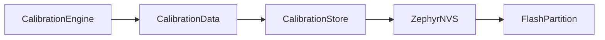

Because persistence is a platform service, `CalibrationStore` is an intentional exception to the statement that all device-related services pass through `Hal.h`.

---

# 14. Hardware Abstraction Layer

## 14.1 Purpose

The HAL provides the hardware boundary used by controller, calibration, telemetry, and test code. Higher-level motor-control code consumes physical units and unified actuator commands rather than MCU registers.

## 14.2 Public Data Types

The HAL exposes:

- Phase currents
- DC bus voltage and current
- Phase voltages
- Mechanical and electrical rotor state
- Thermal measurements
- Raw ADC snapshots for bring-up
- Unified PWM command
- Sensor-update status

## 14.3 Internal HAL Composition

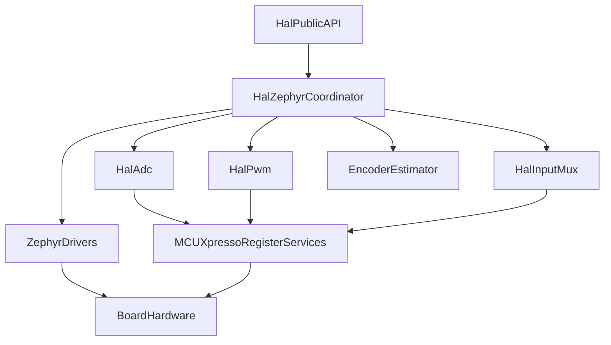

The implementation intentionally uses both Zephyr device APIs and lower-level NXP/MCUXpresso register services where precise peripheral behavior is required.

## 14.4 HAL Responsibilities

The HAL owns:

- Board-level peripheral initialization
- PWM configuration and phase mapping
- PWM-originated ADC trigger generation
- INPUTMUX trigger routing
- Fast and thermal ADC acquisition
- Raw-to-engineering-unit conversion
- MA732 SPI acquisition coordination
- Coherent sensor caches
- Application of unified PWM commands
- Hardware fault status and clear hooks

The HAL does not own controller objectives, calibration sequencing, commutation mathematics, or experiment policy.

## 14.5 Hardware Revision Measurements

The interfaces include V2 phase-voltage and expanded thermal measurements. Consumers must use validity information rather than assuming every field is available on every hardware revision.

---

# 15. Telemetry Architecture

## 15.1 Purpose

Telemetry provides the stable UART contract used by experiment firmware and host-side acquisition tools.

It owns:

- Packed packet layout and version
- Experiment status and fault metadata
- Trigger-byte detection
- V1/V2 measurement-validity flags
- Packet decimation
- Packet checksum
- Bounded single-producer/single-consumer queue
- Asynchronous UART transport
- Drop and transmit-error counters

## 15.2 Execution Contract

`Telemetry_Update16kHz()` performs only bounded producer work:

1. Poll for the trigger byte without blocking.
2. Return immediately when telemetry is disabled.
3. Advance the decimation counter.
4. Build and enqueue a packet when due.
5. Never wait for UART completion.

The UART callback owns transmission completion, queue advancement, and starting the next packet.

## 15.3 Data Sources

Telemetry reads cached HAL measurements and combines them with application-provided metadata such as:

- Speed command
- Test state
- Active commutation mode
- Experiment lifecycle status
- Experiment fault code
- V2 measurement validity

Telemetry does not own controller behavior or experiment timing.

## 15.4 Overflow Policy

The packet ring is bounded. When the producer outruns the UART consumer, packets may be dropped and the drop counter is incremented. The control path must not block to preserve packets.

---

# 16. Communication and Object Dictionary Architecture

## 16.1 UART

UART telemetry is implemented and operational. It is the current external interface for experiments, host triggers, and binary measurement transport.

## 16.2 Object Dictionary

`Od` owns one global shared data structure containing:

- Command objects
- Configuration objects
- Telemetry objects

It contains no control algorithm and no bus transport.

## 16.3 CAN Translation Layer

`CanComms` is intended to:

- Copy internal telemetry into the Object Dictionary
- Decode requested control and commutation modes
- Dispatch arm, disarm, clear-fault, and setpoint requests
- Provide a CANopen communication-reset hook

## 16.4 Current CAN Status

CAN is unfinished and must be treated as non-operational.

The repository currently contains an Object Dictionary and a partial translation layer, but the supplied implementation does not provide a complete working CAN transport. The translation source also references `FSM_STATE_RUNNING`, while the implemented FSM uses `FSM_STATE_CLOSED_LOOP`; this mismatch must be resolved before the path can build or operate as intended.

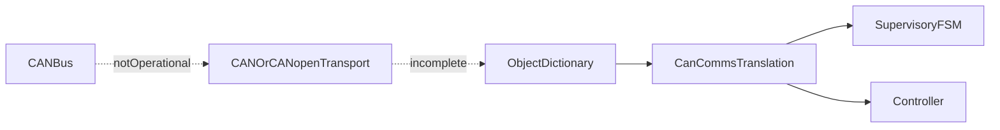

Until the transport, scheduling, concurrency rules, and state-name mismatch are resolved, CAN must not be described as a supported runtime interface.

---

# 17. Configuration Architecture

`Config.h` is the central compile-time configuration source for:

- System timing
- Hardware conversion constants
- Encoder and motor parameters
- Safety limits
- Calibration limits
- Controller tuning profiles
- Optional measurement and FOC features
- CAN node identifiers

It must not contain runtime state, control sequencing, peripheral initialization, or calibration algorithms.

Compile-time configuration should remain explicit and should not silently change subsystem ownership.

---

# 18. Fault and Safe-State Architecture

Fault handling is distributed by ownership:

| Owner | Fault Responsibility |
|-------|----------------------|
| HAL | Report hardware-level fault state and sensor-update status |
| Controller | Validate control-path prerequisites, latch controller fault, and apply safe output |
| Calibration | Report terminal calibration failures |
| FSM | Transition the overall wheel lifecycle into and out of fault state |
| Telemetry | Report experiment-facing fault metadata without making control decisions |

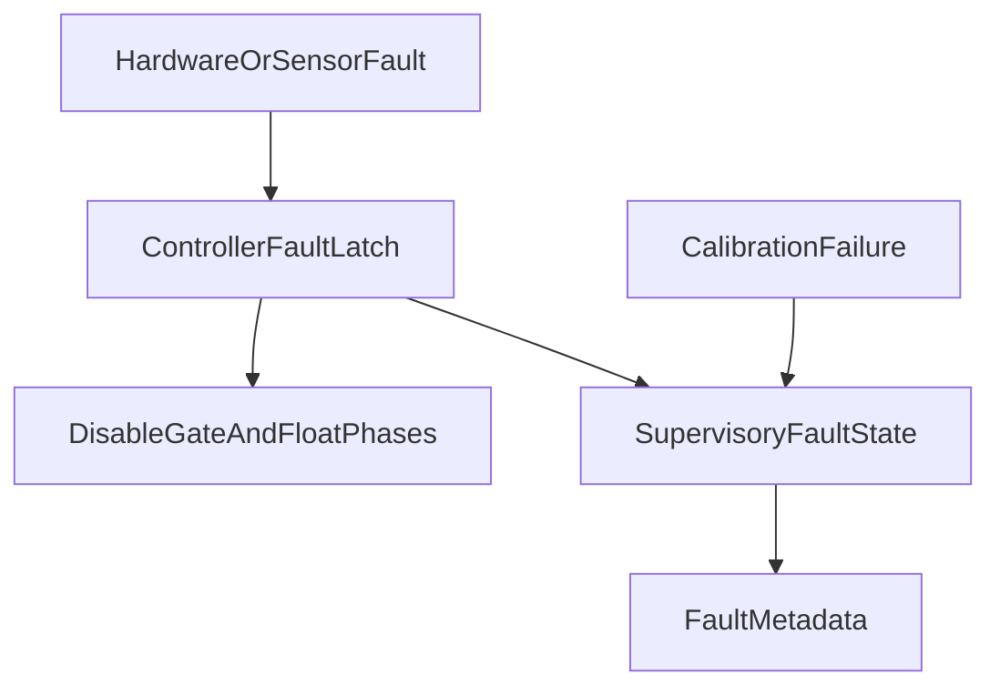

Fault recovery is explicit. Clearing controller state does not implicitly clear hardware faults.

---

# 19. Implementation Status

| Capability | Status | Notes |
|------------|--------|-------|
| 16 kHz controller entry point | Implemented | Single production entry point in `Controller` |
| HAL sensor cache and PWM actuation | Implemented | Includes PWM-synchronous fast ADC path |
| MA732 rotor estimation | Implemented | Sample interval supplied by HAL |
| Current preprocessing | Implemented | Feature-selectable reconstruction and common-mode removal |
| FOC | Implemented | Current PI, feedforward options, limiting, anti-windup, SVM, diagnostics |
| Sinusoidal commutation | Implemented | Direct sinusoidal PWM |
| Trapezoidal commutation | Implemented | Six-step, forward/coast behavior |
| Open-loop vector commutation | Implemented | Supplied-angle inverse Park and SVM |
| Calibration engine | Implemented | Deterministic multi-stage calibration |
| Calibration persistence | Implemented | NVS, versioning, and CRC |
| Supervisory FSM | Implemented | Coarse lifecycle supervision |
| UART telemetry | Implemented | Non-blocking producer plus async callback consumer |
| Object Dictionary | Implemented as storage | No transport by itself |
| CAN translation | Partial | Internal translation scaffolding exists |
| CAN/CANopen runtime communication | Not operational | Transport integration and implementation corrections remain |

---

# 20. Dependency Rules

The codebase is not a perfectly strict adjacent-layer stack, but dependencies must remain intentional and one-directional with respect to ownership.

## 20.1 Permitted Dependencies

| Module | Permitted Dependencies |
|--------|------------------------|
| Application | FSM, Controller, Calibration public API, Telemetry, CAN translation when completed, HAL test APIs |
| FSM | Controller, Calibration, HAL fault API |
| Controller | HAL, Calibration, CalibrationStore initialization, CurrentPreprocess, Commutation interfaces, configuration, math |
| Calibration | Commutation data types, Encoder configuration API, CalibrationStore, configuration, math |
| Commutation Strategy | Common commutation types, calibration parameters where required, configuration, math |
| CurrentPreprocess | HAL data types, configuration, generic math |
| Encoder | Configuration and generic math |
| HAL Coordinator | Encoder and low-level HAL services |
| Low-Level HAL | Zephyr and MCUXpresso platform services |
| Telemetry | HAL cached measurements, Zephyr UART/kernel services |
| CalibrationStore | Calibration data type, Zephyr NVS/flash/CRC services |
| CAN Translation | Object Dictionary, FSM, Controller, HAL, encoder/diagnostics as required |
| Object Dictionary | Standard data types only |
| BldcMath | MathUtil |
| MathUtil | Standard math library only |

## 20.2 Prohibited Coupling

| Module | Must Not Own or Access Directly |
|--------|---------------------------------|
| Application | Peripheral registers or duplicated motor-control algorithms |
| FSM | 16 kHz calculations, PWM generation, commutation math, or transport implementation |
| Controller | UART/CAN transport, experiment sequencing, or peripheral registers |
| Calibration | Application experiment sequencing or direct peripheral registers |
| Commutation Strategy | Controller state, FSM state, UART/CAN, or direct PWM hardware writes |
| CurrentPreprocess | ADC acquisition, PWM writes, or controller policy |
| Encoder | SPI transactions or application policy |
| HAL | Controller objectives, velocity PI policy, or experiment sequencing |
| Telemetry | Controller decisions, PWM generation, or blocking fast-path transport |
| Object Dictionary | Control logic or bus-driver behavior |
| Math Modules | Hardware or application assumptions |

## 20.3 Controlled Platform Exceptions

The following modules intentionally use platform services without routing through the motor-control HAL:

- `Telemetry` uses the Zephyr asynchronous UART API.
- `CalibrationStore` uses Zephyr NVS, flash-map, and CRC services.
- Low-level HAL modules use NXP/MCUXpresso services for precise PWM, ADC, and INPUTMUX control.

These are infrastructure boundaries, not reasons for controller or commutation code to bypass `Hal.h`.

---

# 21. Architectural Decisions

## 21.1 One Production Fast-Loop Entry Point

A single controller entry point fixes ordering, centralizes safety response, and prevents applications from assembling incompatible fast-loop variants.

## 21.2 Unified Commutation Inputs and Outputs

All strategies consume one physical input bundle and return one inverter command. This keeps strategy selection independent of application code and prevents strategies from owning hardware access.

## 21.3 Calibration Inside the Deterministic Path

Calibration shares the same measurement timing and command boundary as normal operation. This avoids creating a second uncontrolled hardware path for calibration actuation.

## 21.4 Cached HAL Measurements

The HAL refreshes a coherent measurement snapshot before higher-level modules read it. Multiple consumers therefore observe the same cycle's measurements without independently accessing peripherals.

## 21.5 Asynchronous Telemetry Transport

The fast path produces bounded packets; the UART callback consumes them. Packet loss is preferable to delaying control execution.

## 21.6 Separate Supervisory and Controller State Machines

The FSM owns wheel lifecycle policy while the controller owns high-rate control modes and dynamic state. Coarse policy does not execute inside the 16 kHz algorithm.

## 21.7 Compile-Time Feature Selection

Hardware parameters, limits, tuning profiles, and optional algorithm features are explicit compile-time configuration. Runtime behavior remains owned by the relevant subsystem.

---

# 22. Extending the Architecture

## 22.1 Adding a Commutation Strategy

A new strategy should:

1. Implement `CommutationStrategy_t`.
2. Consume only `CommutationInputs_t` and strategy-owned configuration.
3. Return a valid `HalPwmCommand_t`.
4. Provide safe behavior for invalid inputs and `Stop()`.
5. Avoid direct HAL or transport access.
6. Add controller binding without changing application control flow.

## 22.2 Adding a Hardware Revision

A hardware revision should primarily update:

- Device tree and board configuration
- Low-level HAL initialization and conversion constants
- Sensor validity and availability reporting
- Fixed phase/pin mappings

Controller and commutation interfaces should remain stable unless the physical control model changes.

## 22.3 Completing CAN

CAN completion requires, at minimum:

1. Resolve the FSM state-name mismatch.
2. Integrate and initialize the intended CAN or CANopen transport.
3. Define the task/thread or callback that services transport work.
4. Define synchronization rules for Object Dictionary access.
5. Define command freshness, range validation, and timeout behavior.
6. Map controller and hardware faults into bus-visible status.
7. Add integration tests before declaring CAN operational.

## 22.4 Extending Telemetry

New telemetry fields must preserve:

- Explicit packet versioning
- Fixed packing and size checks
- Hardware-revision validity flags
- Bounded fast-path work
- Backward-compatible host parsing or an intentional version transition

---

# 23. Review Checklist

A change is architecturally consistent when:

- The 16 kHz path remains bounded and non-blocking.
- Sensor acquisition still precedes control calculation.
- Safety validation still precedes active actuation.
- The controller remains the only production owner of final PWM application.
- Commutation strategies return commands instead of writing hardware.
- Applications compose modules rather than duplicate them.
- Calibration uses the normal deterministic command path.
- Telemetry transport remains outside the producer's critical work.
- Hardware-specific behavior remains in HAL or an explicitly documented platform service.
- CAN is not represented as operational until transport and integration are complete.

---

# 24. Summary

The OreSat reaction wheel firmware is organized around one deterministic controller path, a coarse supervisory FSM, coherent HAL measurement caches, interchangeable commutation strategies, a controller-hosted calibration engine, and non-blocking experiment telemetry.

The architecture intentionally separates control objectives, electrical synthesis, hardware access, lifecycle supervision, persistence, and transport. Preserving these ownership boundaries allows the firmware to evolve across experiments, commutation algorithms, and hardware revisions without compromising the timing or safety of the production motor-control path.